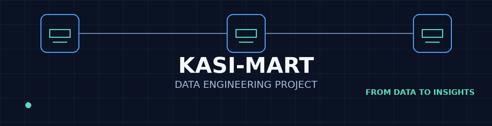

<div align="center">



# 🛒 Kasi-Mart Data Engineering Project

### A Snowflake-based data engineering project for transforming retail data into useful business insights.

[](#)
[](#)
[](#)
[](#)

</div>

---

## 📌 Project Overview

Kasi-Mart is a small retail data engineering project designed to demonstrate how raw business data can be loaded into a cloud data warehouse, structured into related tables, validated, and queried to answer practical business questions.

The project uses **Snowflake** as the primary data platform. Three CSV datasets were loaded into a Snowflake database and schema:

- **CUSTOMERS** — customer information
- **PRODUCTS** — product and pricing information
- **ORDERS** — customer purchase transactions

The project then uses SQL joins, aggregations, grouping, calculated fields, sorting, and limiting to turn the transactional data into business-focused results.

The main objective was not simply to write SQL queries, but to follow a complete beginner-friendly data engineering workflow:

> **Source data → Snowflake → Tables → Relationships → Validation → SQL analysis → Results → Documentation**

---

## 🎯 Project Objectives

The project was completed to demonstrate the ability to:

- Create a Snowflake database and schema.
- Create tables with appropriate data types.
- Load CSV data into Snowflake.
- Validate that the expected records were loaded.
- Understand relationships between dimension and transaction tables.
- Use primary-key and foreign-key concepts.
- Join related tables using business keys.
- Calculate revenue from quantity and unit price.
- Aggregate revenue by customer and category.
- Identify the top five customers by total spend.
- Export query results for documentation.
- Document the process and findings in GitHub.

---

# 🏪 The Kasi-Mart Data Model

The project uses three related tables.

```text
                 ┌──────────────────────┐
                 │      CUSTOMERS       │
                 ├──────────────────────┤
                 │ PK customer_id       │
                 │ customer_name        │
                 │ email                │
                 │ province             │
                 │ signup_date          │
                 └──────────┬───────────┘
                            │
                            │ 1 : Many
                            ▼
                 ┌──────────────────────┐
                 │        ORDERS        │
                 ├──────────────────────┤
                 │ PK order_id          │
                 │ FK customer_id       │
                 │ FK product_id        │
                 │ order_date           │
                 │ quantity             │
                 └──────────┬───────────┘
                            ▲
                            │ Many : 1
                            │
                 ┌──────────┴───────────┐
                 │       PRODUCTS       │
                 ├──────────────────────┤
                 │ PK product_id        │
                 │ product_name         │
                 │ category             │
                 │ unit_price           │
                 └──────────────────────┘
```

### Relationship design

- One customer can place many orders.
- One product can appear in many orders.
- `ORDERS.customer_id` connects orders to `CUSTOMERS.customer_id`.
- `ORDERS.product_id` connects orders to `PRODUCTS.product_id`.
- `ORDERS` acts as the transaction table connecting customer and product information.

A detailed ERD generated from the Snowflake schema using DBeaver is available here:

**[View the Data Model](documentation/data_model.png)**

---

# 🧱 Snowflake Environment

The project was created using the following Snowflake objects:

| Object | Name |
|---|---|
| Database | `DE_PROJECT1` |
| Schema | `KASI_MART` |
| Warehouse | `SNOWFLAKE_LEARNING_WH` |

The warehouse was used to execute the SQL queries in Snowflake.

---

# 📊 Dataset

The project contains three CSV files.

## 1. Customers

**File:** `customers.csv`

| Column | Data Type | Purpose |
|---|---|---|
| `customer_id` | STRING | Customer identifier / PK |
| `customer_name` | STRING | Customer name |
| `email` | STRING | Customer email |
| `province` | STRING | Customer province |
| `signup_date` | DATE | Customer signup date |

**Expected records:** 50

---

## 2. Products

**File:** `products.csv`

| Column | Data Type | Purpose |
|---|---|---|
| `product_id` | STRING | Product identifier / PK |
| `product_name` | STRING | Product name |
| `category` | STRING | Product category |
| `unit_price` | NUMBER | Product selling price |

**Expected records:** 20

---

## 3. Orders

**File:** `orders.csv`

| Column | Data Type | Purpose |
|---|---|---|
| `order_id` | STRING | Order identifier / PK |
| `customer_id` | STRING | Customer reference / FK |
| `product_id` | STRING | Product reference / FK |
| `order_date` | DATE | Date of order |
| `quantity` | NUMBER | Number of units ordered |

**Expected records:** 150

---

# 🛠️ Tools & Technologies

## ❄️ Snowflake

**Primary platform and SQL execution environment**

Snowflake was used for:

- Database creation
- Schema creation
- Table creation
- Data loading
- Data validation
- SQL querying
- Revenue calculations
- Aggregations
- Business analysis

Snowflake was chosen because it is a cloud data platform designed for storing and analysing structured data at scale. For this project, it also provided a practical environment for learning modern cloud data engineering concepts.

---

## 🧮 SQL

SQL was the main language used to work with the data.

The project demonstrates:

- `SELECT`
- `JOIN`
- `GROUP BY`
- `SUM`
- Calculated columns
- `ORDER BY`
- `LIMIT`
- Primary-key and foreign-key concepts

The SQL was intentionally kept straightforward so that each query could be understood and explained clearly.

---

## 🐘 DBeaver

DBeaver was used for **database structure visualisation and ERD documentation** after the Snowflake environment had been created.

It was used to:

- Connect to the Snowflake account.
- Browse `DE_PROJECT1`.
- Browse the `KASI_MART` schema.
- View the `CUSTOMERS`, `ORDERS`, and `PRODUCTS` tables.
- Generate the ER diagram.
- Capture evidence of the Snowflake schema and relationships.

The actual data loading, SQL analysis, and query execution were performed in Snowflake.

---

## 🐙 GitHub

GitHub was used to document and organise the finished project.

It provides a central place for:

- SQL scripts
- Source CSV files
- Query results
- Screenshots
- Data model documentation
- Project README

The goal was to make the project reproducible and easy for another person to understand.

---

# 🔄 Process Followed

## Step 1 — Review the source data

The three CSV files were reviewed before loading.

The datasets represented:

```text
Customers → Products → Orders
```

The table structure was considered before creating the Snowflake tables so that the data types could be defined appropriately.

---

## Step 2 — Create the Snowflake environment

A dedicated database and schema were created:

```sql
CREATE DATABASE DE_PROJECT1;

CREATE SCHEMA KASI_MART;
```

A Snowflake warehouse was used to execute the project queries.

---

## Step 3 — Create the tables

The three tables were created with specific data types instead of storing everything as text.

For example:

```sql
CREATE TABLE CUSTOMERS (
    customer_id STRING,
    customer_name STRING,
    email STRING,
    province STRING,
    signup_date DATE
);
```

The same approach was used for `PRODUCTS` and `ORDERS`.

This was important because dates and numerical values should be stored using appropriate data types rather than treating every field as a string.

---

## Step 4 — Load the CSV files

The CSV files were loaded into the appropriate Snowflake tables.

The three source datasets were loaded without changing their original business information.

---

## Step 5 — Validate the load

Record counts were checked after loading.

Expected results:

| Table | Expected Rows |
|---|---:|
| CUSTOMERS | 50 |
| PRODUCTS | 20 |
| ORDERS | 150 |
| **Total** | **220** |

This validation step confirmed that the expected number of records had been loaded.

---

## Step 6 — Understand the relationships

The relationships between the tables were reviewed.

```text
CUSTOMERS.customer_id
        ↓
ORDERS.customer_id

PRODUCTS.product_id
        ↓
ORDERS.product_id
```

This relationship structure made it possible to combine customer, product, and order information in the analysis queries.

---

## Step 7 — Build the SQL analysis

Four queries were developed based on the required business questions.

The queries progress from detailed transaction-level information to higher-level business summaries.

### Query 1
**Every order with customer and product information**

### Query 2
**Total revenue per customer**

### Query 3
**Total revenue per product category**

### Query 4
**Top 5 customers by total spend**

---

# 🔎 Query 1 — Order Detail Join

### Business question

> What does each order contain, who placed it, what product was purchased, and what was the revenue generated?

### What the query does

The first query joins all three tables:

```text
ORDERS
   ↓
CUSTOMERS
   ↓
PRODUCTS
```

It returns:

- Order ID
- Customer name
- Product name
- Product category
- Quantity
- Unit price
- Line revenue

The calculated revenue is:

```text
line_revenue = quantity × unit_price
```

### Why it matters

This creates a detailed view of each transaction and demonstrates how related data stored in separate tables can be combined for analysis.

**[View SQL](sql/query_01_order_detail_join.sql)**  
**[View Results](results/output_01_order_detail_join.csv)**  
**[View Screenshot](screenshots/query_01_order_detail_join.png)**

---

# 👤 Query 2 — Total Revenue per Customer

### Business question

> How much revenue does each customer contribute?

### What the query does

The query calculates total revenue for each customer by summing:

```text
quantity × unit_price
```

for all orders belonging to that customer.

### Why it matters

This allows the business to understand customer contribution to revenue and identify customers with higher levels of spending.

**[View SQL](sql/query_02_total_revenue_per_customer.sql)**  
**[View Results](results/output_02_total_revenue_per_customer.csv)**  
**[View Screenshot](screenshots/query_02_total_revenue_per_customer.png)**

---

# 🛍️ Query 3 — Total Revenue per Product Category

### Business question

> Which product categories generate the most revenue?

### What the query does

The query joins `ORDERS` and `PRODUCTS`, calculates revenue for each order, and groups the results by product category.

### Why it matters

Category-level analysis helps the business compare product performance and understand where revenue is being generated.

**[View SQL](sql/query_03_total_revenue_per_product_category.sql)**  
**[View Results](results/output_03_total_revenue_per_product_category.csv)**  
**[View Screenshot](screenshots/query_03_total_revenue_per_product_category.png)**

---

# 🏆 Query 4 — Top 5 Customers by Total Spend

### Business question

> Who are Kasi-Mart's five highest-spending customers?

### What the query does

The query:

1. Calculates revenue for each customer's orders.
2. Groups the revenue by customer.
3. Sorts customers from highest to lowest spend.
4. Returns the first five customers.

### Why it matters

The result highlights the highest-value customers and can support future customer retention, loyalty, and sales strategies.

**[View SQL](sql/query_04_top_5_customers_by_total_spend.sql)**  
**[View Results](results/output_04_top_5_customers_by_total_spend.csv)**  
**[View Screenshot](screenshots/query_04_top_5_customers_by_total_spend.png)**

---

# 📈 Findings

The four queries provide four different levels of business visibility:

| Analysis | Insight |
|---|---|
| Order detail | Shows individual transactions |
| Revenue per customer | Shows customer contribution to revenue |
| Revenue per category | Shows category performance |
| Top 5 customers | Highlights highest-value customers |

### Key analytical takeaway

The project demonstrates how transactional data can be transformed into increasingly useful business views:

```text
Individual Orders
       ↓
Customer Revenue
       ↓
Category Revenue
       ↓
High-Value Customers
       ↓
Business Decisions
```

> **Note:** The exported CSV files contain the detailed numerical results. The README intentionally describes the analytical purpose without inventing values that are not independently recorded here.

---

# 🧪 Data Validation

The project validated the number of records loaded into each table.

```text
CUSTOMERS = 50
PRODUCTS  = 20
ORDERS    = 150
```

Validation was important because a successful file upload alone does not guarantee that the expected data was loaded correctly.

The validation SQL is available here:

**[View Validation SQL](sql/03_validation.sql)**

---

# 📁 Repository Structure

```text
kasi-mart-data-engineering-project1/
│
├── README.md
│
├── data/
│   ├── customers.csv
│   ├── products.csv
│   └── orders.csv
│
├── sql/
│   ├── query_01_order_detail_join.sql
│   ├── query_02_total_revenue_per_customer.sql
│   ├── query_03_total_revenue_per_product_category.sql
│   └── query_04_top_5_customers_by_total_spend.sql
│
├── results/
│   ├── output_01_order_detail_join.csv
│   ├── output_02_total_revenue_per_customer.csv
│   ├── output_03_total_revenue_per_product_category.csv
│   └── output_04_top_5_customers_by_total_spend.csv
│
├── screenshots/
│   ├── query_01_order_detail_join.png
│   ├── query_02_total_revenue_per_customer.png
│   ├── query_03_total_revenue_per_product_category.png
│   ├── query_04_top_5_customers_by_total_spend.png
│   └── dbeaver_snowflake_connection_and_erd.png
│
└── documentation/
    ├── data_model.png
    ├── kasi_mart_banner.gif
    └── query_write_up.md
```

---

# 📸 Project Evidence

The repository includes screenshots showing the practical work completed during the project.

### Snowflake / DBeaver

The DBeaver evidence screenshot shows the Snowflake connection, database, schema, tables, and generated ERD.

**[View DBeaver ERD Evidence](screenshots/dbeaver_snowflake_connection_and_erd.png)**

### Query Evidence

Each query has a corresponding screenshot containing the SQL and resulting output.

- **[Query 1 Screenshot](screenshots/query_01_order_detail_join.png)**
- **[Query 2 Screenshot](screenshots/query_02_total_revenue_per_customer.png)**
- **[Query 3 Screenshot](screenshots/query_03_total_revenue_per_product_category.png)**
- **[Query 4 Screenshot](screenshots/query_04_top_5_customers_by_total_spend.png)**

---

# 📚 What I Learned

This project helped strengthen several practical data engineering skills.

### 1. Data types matter

Instead of creating every column as `VARCHAR`, the tables use:

- `STRING` for text
- `DATE` for dates
- `NUMBER` for numerical values

Choosing appropriate data types improves data quality and makes analysis easier.

### 2. Relational modelling matters

Customer and product information is stored separately from order transactions.

This avoids unnecessarily repeating the same customer and product information for every order.

### 3. Joins connect business information

The `ORDERS` table contains the keys needed to connect transactions to customers and products.

Understanding these relationships is essential when working with relational data.

### 4. Aggregations turn transactions into insights

A list of orders is useful, but aggregations make the data more useful for decision-making.

For example:

```sql
SUM(quantity * unit_price)
```

can transform individual transactions into revenue metrics.

### 5. Validation is part of data engineering

Checking record counts after loading is a simple but important data-quality step.

### 6. Documentation is part of the project

A data engineering project should explain not only **what was built**, but also:

- Why the tools were selected
- How the data was structured
- How the data was loaded
- How the results were validated
- What the queries answer
- Why the findings matter

---

# 🚀 Future Improvements

If this project were expanded beyond the exercise, potential improvements could include:

- Adding automated data-quality checks.
- Adding constraints and stronger validation rules.
- Creating reusable analytical views.
- Adding additional business metrics.
- Building a BI dashboard using the curated Snowflake data.
- Adding incremental loading rather than only loading static CSV files.
- Adding orchestration for automated data pipelines.
- Introducing more detailed customer and product dimensions.
- Monitoring data freshness and load failures.

---

# 💡 Final Project Summary

Kasi-Mart demonstrates a complete small-scale data engineering workflow using Snowflake.

The project starts with three CSV datasets and builds them into a structured relational model. The data is loaded into Snowflake, validated, connected through keys, and analysed using SQL.

The final queries demonstrate how the same underlying data can answer different business questions, from understanding individual orders to identifying customers and product categories that contribute to revenue.

```text
                RAW CSV DATA
                     │
                     ▼
             ┌───────────────┐
             │   SNOWFLAKE   │
             │  DE_PROJECT1  │
             │   KASI_MART   │
             └───────┬───────┘
                     │
          ┌──────────┼──────────┐
          ▼          ▼          ▼
      CUSTOMERS   PRODUCTS    ORDERS
          │          │          │
          └──────────┼──────────┘
                     ▼
              RELATIONAL MODEL
                     │
                     ▼
                SQL ANALYSIS
                     │
          ┌──────────┼──────────┐
          ▼          ▼          ▼
      CUSTOMER    CATEGORY    TOP 5
       REVENUE     REVENUE    CUSTOMERS
          │          │          │
          └──────────┼──────────┘
                     ▼
              BUSINESS INSIGHTS
```

---

<div align="center">

### 🛒 Kasi-Mart Data Engineering Project

**Snowflake • SQL • Data Modelling • Data Analysis • GitHub**

*From data to stronger decisions.*

</div>
